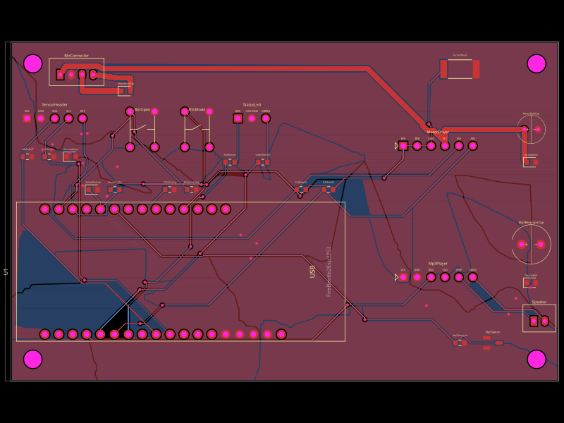
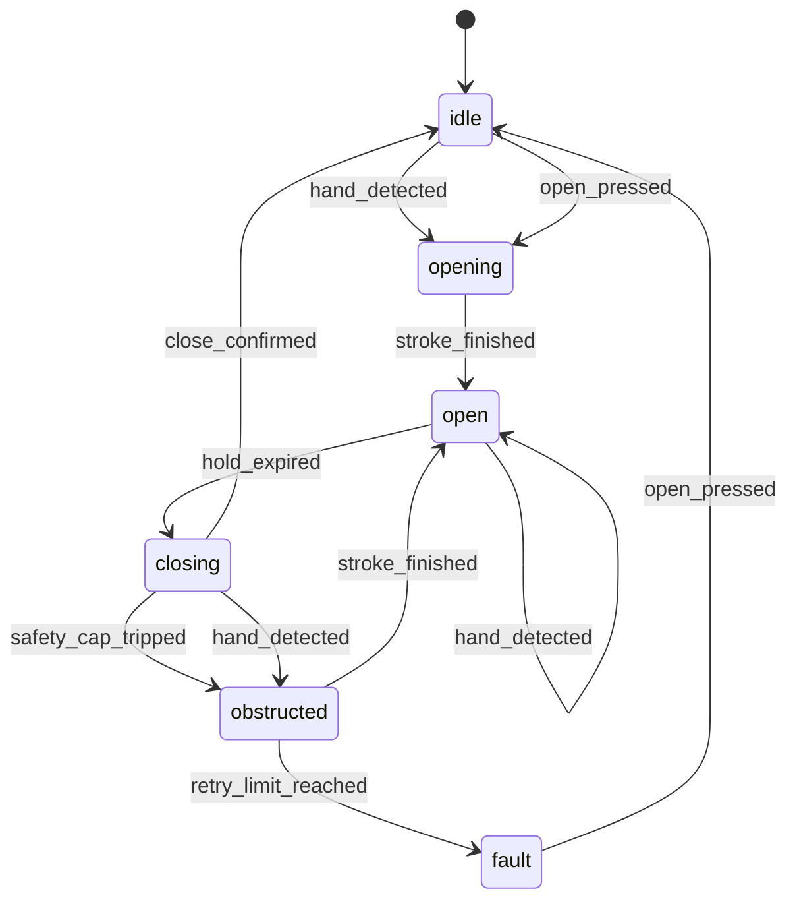

# Sisuo brain transplant

A sensor-operated trash can whose control board died. Rather than bin the bin, its brain was
replaced: a **Seeed XIAO ESP32-C6** running MicroPython, driving the original motor, with a new
PCB designed in code.



## Status, honestly

| Part | State |
| --- | --- |
| Firmware | Written, 79 tests passing, **simulated end to end** on a real MicroPython runtime and on a simulated ESP32-C6 in Wokwi |
| PCB | v2 drawn and routed: 45 traces, 0 errors, fab package generated. Never fabricated |
| Hardware | **Nothing has been run on a bench yet.** Parts are still being ordered |

Everything here is verified by tests and simulation, not by a working bin. Where something is
unproven, the docs say so.

## How the lid behaves

The behaviour is a transition table rather than a pile of conditionals, so it can be read as a
picture. This one is abridged for readability — every state can also fault on a dead sensor;
`firmware/micropython/tools/fsm_diagram.py` prints the full table, and `make check` keeps the
unabridged copy in the firmware README honest:



The original bin failed by retrying a close forever, waiting for a signal that never came. This
one reopens, retries a fixed number of times, then latches a fault and waits for a person.

## What's interesting here

* **The safety cap is structural.** Every motor stroke is bounded inside its own loop and stops
  in a `finally`, so no sensor, detector or calibration mistake can burn the motor.
* **Strategies for what the hardware hasn't decided.** How a hand is noticed (time-of-flight,
  infrared, or buttons only), how "shut" is known (timed, limit switch, or motor stall), and
  what idling costs (stay awake or deep sleep) are each one line of config.
* **Sounds are data.** A profile maps "state entered" to a track number, so re-voicing the bin
  never means touching code. The MODE button cycles profiles and remembers the choice.
* **Three layers of testing**, none of which needs the hardware — and the middle one found a real
  bug: a hand left in front of the sensor held the lid open until the battery would have died.

## Testing

```sh
make            # regenerate everything derived from the board design
make check      # verify firmware, board and simulation still describe the same bin
make simulate   # run the firmware on a simulated ESP32-C6 (needs a Wokwi token)
```

You will need `bun`, `mpy-cross` (`pip install mpy-cross`), node 20 and, for the MicroPython
layer, `brew install micropython`. `make check` says which step fails if one is missing.

Just the firmware tests, with none of that:

```sh
cd firmware/micropython
python3 -m unittest discover -s tests -t tests   # 79 tests, ~1 s, no hardware
```

The second one matters: MicroPython's asyncio is not CPython's — a task cannot cancel itself —
and the firmware does exactly that on every lid stroke. A fake that was more forgiving than the
device once hid a bug that would have frozen the lid after a single open.

## Layout

```
firmware/micropython/   the firmware — start at smartbin/__init__.py, which is a guided tour
firmware/arduino/       the first version, kept for reference
board.tsx               the PCB, in code (tscircuit)
parts/                  datasheets, pinouts, and the sensor research
sim/                    simulation: MicroPython runtime and Wokwi
```

Where to go next: [STATUS.md](STATUS.md) for what is done and what is blocked,
[firmware/micropython/README.md](firmware/micropython/README.md) for the firmware and how to put
it on a board, and [`smartbin/__init__.py`](firmware/micropython/smartbin/__init__.py) — whose
docstring is a guided tour of how the code fits together.

Design notes worth reading: [`FIRMWARE_PLAN.md`](FIRMWARE_PLAN.md) (architecture and the audit
that reshaped it), [`parts/SENSOR_OPTIONS.md`](parts/SENSOR_OPTIONS.md) (why a time-of-flight
sensor, and what its datasheet demands of the lid window),
[`LID_CLOSE_DETECTION.md`](LID_CLOSE_DETECTION.md) (how motorised bins actually detect a closed
lid, with patents), and [`TEST_PROTOCOL.md`](TEST_PROTOCOL.md) (reverse-engineering the dead
board with a multimeter).

## Hardware

Seeed XIAO ESP32-C6 · L9110S H-bridge driving the bin's original motor · VL6180X time-of-flight
sensor · DFRobot DFR0534 MP3 module and speaker · two buttons and a bicolour status LED.
Logic and audio run from a LiPo; the motor keeps the bin's own 6 V pack, sharing only ground.
