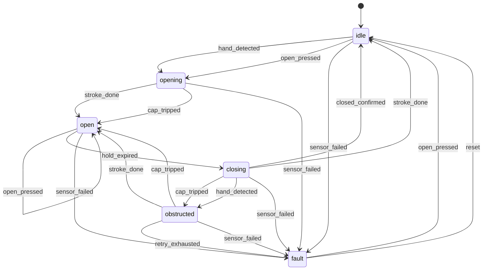

# Smart Bin firmware — MicroPython

**Start with [`smartbin/__init__.py`](smartbin/__init__.py)** — its module docstring is the tour:
the five layers and the rule for where a thing belongs, how the parts connect, and what happens
end to end when someone waves a hand at the bin. Everything else is one chapter of that.

The rule in one line: **a device is a thing you command (`hardware.py`); a strategy is a decision
you make with it (`proximity.py`, `close_detection.py`, `power.py`, chosen in `assembly.py`).**

Design and rationale: [`../../FIRMWARE_PLAN.md`](../../FIRMWARE_PLAN.md).
The Arduino v1 sketch in `../arduino/` is kept only as a reference.

## Layout
```
boot.py              deliberately empty (see its docstring for why)
main.py              two lines; hold MODE at boot to skip auto-start
config.py            every tunable + pin map; /config.json overrides per unit
smartbin/            the firmware package
  __init__.py        START HERE: the tour (and re-exports build/run)
sim/                 Wokwi simulation: diagram, scenario, custom-chip notes
  assembly.py        the composition root: build(), run(), and every "which one" choice
  states.py          states, triggers and the transition table — the product, as data
  state_machine.py   walks that table: hooks, history, event publishing
  lid.py             motion strokes + the hard safety cap
  proximity.py       ProximitySensor + ToF / self-ranging ToF / IR burst / button-only
  close_detection.py CloseDetector + timed / limit-switch / motor-stall
  power.py           PowerPolicy + stay-awake / deep-sleep
  audio.py           Player + DFR0534 / silent
  motor.py           MotorDriver + L9110S
  buttons.py status_led.py   the two buttons and the bicolour LED
  hardware.py        every device: motor, buttons, LED, MP3, rangefinder, switches
  board.py           ESP32-C6 facts: wake pins, deep sleep, watchdog
  smart_bin.py       the running application: three tasks and the wiring between them
  events.py feedback.py vl6180x.py timing.py log.py
bringup/             one script per module, run in order on the bench
tools/               fsm_diagram.py (the diagram below) and calibrate.py (bench procedures)
tests/               runs on the Mac, no hardware
deploy.sh            copy to the device (--mpy to cross-compile first)
```

## Bench workflow
```sh
mpremote mip install aiorepl        # once: the live REPL
./deploy.sh                         # copy the package, config, main.py and boot.py
mpremote repl                       # Ctrl-C stops main.py
```
```python
>>> import smartbin
>>> b = smartbin.build()          # builds everything, starts nothing
>>> b.hardware.scan_i2c()         # ['0x29'] when the ToF sensor is wired
>>> b.hardware.motor.drive(True, 150); b.hardware.motor.stop()
>>> b.sensor.read_distance_mm()
>>> b.lid.fire("open_pressed")    # drive the state machine with no sensor at all
>>> b.lid.state, b.lid.history[-3:]
>>> import smartbin.log as log; log.LEVEL = log.DEBUG
```
With `aiorepl` installed, all of the above also works *while the bin is running*, where the bin
is `b`.

## Bring-up order
Run each from `firmware/micropython/`; only move on when a script prints PASS. Nothing is
written to flash by `mpremote run`.

| Step | Wire up | Run |
| --- | --- | --- |
| 1 | XIAO on USB only | `mpremote run bringup/01_board_alive.py` |
| 2 | OPEN btn D1, MODE btn D6, LED D7/D10 | `mpremote run bringup/02_inputs.py` |
| 3 | VL6180X on D4/D5 (+ INT to D0) | `./deploy.sh` first, then `mpremote run bringup/03_tof.py` (it imports the driver from the device) |
| 4 | DFR0534 on D9, speaker | `mpremote run bringup/04_mp3.py` |
| 5 | L9110S + motor + 6V pack | `mpremote run bringup/05_motor.py` |
| 6 | everything | deploy, then `mpremote repl` and `smartbin.build()` |

## Testing, in three layers
1. **`tests/` on the Mac** — the state machine, timings and strategies, plus device construction
   and the VL6180X's register conversation via `tests/fake_machine.py`, a stand-in for MicroPython's
   `machine` module. Free, about a second.
2. **`sim/` on Wokwi** — a real MicroPython build on a simulated XIAO ESP32-C6. Catches whatever
   depends on the real `machine` module. See [`sim/README.md`](sim/README.md).
3. **The bench** — the only thing that proves it works.

## Tests
```sh
cd firmware/micropython && python3 -m unittest discover -s tests -t tests -v
```
58 tests, no hardware, under two seconds: the safety cap, the open/hold/close cycle, obstruction
retries and the latched fault, transition-table reachability, sensor debounce and cooldown,
button debounce, the LED, the event bus isolating broken listeners, the factory building the
strategy each config string names (and falling back safely on a typo), the config invariants (the
cap exceeds both run times, wake pins are wake-capable, no pin is used twice), and one
integration test that runs the real lid against **real asyncio** rather than the fakes — that
last one exists because a task cancelling itself behaves differently on the device, and a model
of asyncio hid a bug that froze the lid after one open.

## Calibration
`tools/calibrate.py` runs each procedure on the device, prints what it measured and offers to
save it. Run them in this order:

```python
>>> import tools.calibrate as cal
>>> b = cal.bin()
>>> cal.stroke_times(b)    # LID_OPEN_RUN_MS / LID_CLOSE_RUN_MS
>>> cal.tof_window(b)      # watch live distances, choose TOF_NEAR_MM / TOF_FAR_MM
>>> cal.tof_offset(b)      # white target at 50 mm, through the real window
>>> cal.tof_crosstalk(b)   # black target at 100 mm; also sets the range-ignore threshold
>>> cal.stall_counts(b)    # only with CLOSE_DETECTOR = "stall"
```

The two ToF procedures measure the *window*, so run them in the finished lid — re-gluing the
window invalidates them. Anything saved goes to `/config.json`, which deploys never overwrite.
Only calibration keys can be saved: `config.CALIBRATABLE` lists them, and a pin number is not
among them, so a calibration file can never repoint the motor. `config.forget("KEY")` drops a
value; `config.calibration()` shows what this bin has been taught.

## The lid's behaviour

Regenerate with `python3 tools/fsm_diagram.py` — it reads the real table, so it cannot drift.

## The four switches that change how it runs
All in `config.py`; nothing else changes. This is the point of the strategy objects.

| Setting | Values | What changes |
| --- | --- | --- |
| `SENSOR_STRATEGY` | `tof` · `tof_interrupt` · `ir` · `none` | polled I2C ranging · the sensor watches by itself and can wake the chip · IR LED + 38 kHz receiver · buttons only |
| `POWER_POLICY` | `always_on` · `deep_sleep` | stays awake (USB, bench, live REPL) · sleeps when idle and wakes on the ToF interrupt or the OPEN button |
| `CLOSE_DETECTOR` | `timed` · `limit` · `stall` | calibrated run time · microswitch · motor current |
| `ACTIVE_PROFILE` | any key of `SOUND_PROFILES` | which clip plays on which state |

`SENSOR_STRATEGY = "none"` gives a working button-only bin with no sensor wired at all — the lid, the
state machine and the sounds are untouched.

## Deep sleep
`POWER_POLICY = "deep_sleep"` needs `SENSOR_STRATEGY = "tof_interrupt"`, and it rests on facts about this chip
(verified 2026-09-23 against the MicroPython source and the ESP-IDF docs):

* **Only GPIO0-7 can wake an ESP32-C6**, which on the XIAO is D0, D1, D2 and nothing else. The
  pin map spends them on the ToF interrupt (D0), the OPEN button (D1) and the ADC (D2).
* `esp32.wake_on_ext0` **does not exist** on the C6, and `Pin.irq(wake=machine.DEEPSLEEP)`
  silently does nothing. `esp32.wake_on_ext1` is the call that works.
* Low-level wake has an open MicroPython bug (#17334, "stuck pin"), so wake is **active-high**
  and the sensor's interrupt polarity is set to match.
* **Waking is a reset**: `main.py` re-runs, ~100-300 ms, and only `machine.RTC().memory()`
  survives. `DeepSleepPolicy.prepare()` turns "which pin woke us" into a trigger, so the hand
  that woke the bin does not have to wave twice.
* Expect **~200-400 uA** total idle, dominated by the sensor (~340 uA at 500 ms, ~170 uA at 1 s),
  with the ESP32 itself at ~15 uA — but ~300 uA extra if the LiPo sags toward 3.3 V, because the
  XIAO's regulator changes mode. Roughly months on a 1000 mAh cell.
* `machine.wake_pins()` is how the bin tells the sensor from the button. Builds without it report
  only *that* something woke the chip, so the bin reads the pins itself instead.
* **All wake sources share one polarity** (`config.WAKE_ON_HIGH`), because the chip applies one
  level to all of them. The wiring must agree with the flag: a ground-wired button idles high, so
  with wake-on-high it would wake the instant the bin slept, forever.

Bench: `b.sleep_now()` sleeps immediately, for measuring idle current without waiting.

## Sounds
`config.SOUND_PROFILES` maps "state entered" to a track number. An unmapped state is silence, so
`silent` is an empty profile. The MODE button cycles profiles and remembers the choice in
`/config.json`. Re-voicing the bin never means touching code.
