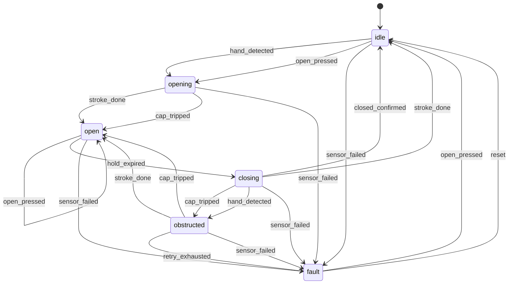

# Smart Bin firmware — MicroPython

Design and rationale: [`../../FIRMWARE_PLAN.md`](../../FIRMWARE_PLAN.md).
The Arduino v1 sketch in `../arduino/` is kept only as a reference.

## Layout
```
boot.py              WiFi off, nothing else
main.py              two lines; hold MODE at boot to skip auto-start
config.py            every tunable + pin map; /config.json overrides per unit
smartbin/            the firmware package
  states.py          states, triggers and the transition table — the product, as data
  fsm.py             the state machine: hooks, history, event publishing
  lid.py             motion strokes + the hard safety cap
  sensors.py         ToF / IR burst / button-only strategies
  closing.py         timed / limit-switch / stall close detection
  motor.py ui.py audio.py feedback.py vl6180x.py hw.py app.py
bringup/             one script per module, run in order on the bench
tools/fsm_diagram.py prints the state diagram from the real table
tests/               runs on the Mac, no hardware
```

## Bench workflow
```sh
mpremote mip install aiorepl        # once: the live REPL
mpremote cp -r smartbin/ :          # deploy the package
mpremote cp config.py main.py boot.py :
mpremote repl                       # Ctrl-C stops main.py
```
```python
>>> import smartbin
>>> b = smartbin.build()          # builds everything, starts nothing
>>> b.hw.scan_i2c()               # ['0x29'] when the ToF sensor is wired
>>> b.hw.motor.drive(True, 150); b.hw.motor.stop()
>>> b.sensor.read()               # distance in mm
>>> b.lid.fire("open_pressed")    # drive the state machine with no sensor at all
>>> b.lid.state, b.lid.history[-3:]
>>> import smartbin.log as log; log.LEVEL = log.DEBUG
```
With `aiorepl` installed, all of the above also works *while the bin is running*.

## Bring-up order
Run each from `firmware/micropython/`; only move on when a script prints PASS. Nothing is
written to flash by `mpremote run`.

| Step | Wire up | Run |
| --- | --- | --- |
| 1 | XIAO on USB only | `mpremote run bringup/01_board_alive.py` |
| 2 | OPEN btn D1, MODE btn D6, LED D7/D10 | `mpremote run bringup/02_inputs.py` |
| 3 | VL6180X on D4/D5 (+ INT to D0) | `mpremote run bringup/03_tof.py` |
| 4 | DFR0534 on D9, speaker | `mpremote run bringup/04_mp3.py` |
| 5 | L9110S + motor + 6V pack | `mpremote run bringup/05_motor.py` |
| 6 | everything | deploy, then `mpremote repl` and `smartbin.build()` |

## Tests
```sh
cd firmware/micropython && python3 -m unittest discover -s tests -t tests -v
```
15 tests, no hardware: the safety cap, the open/hold/close cycle, obstruction retries and the
latched fault, the transition table's reachability, and the event bus isolating broken listeners.

## Calibration, in order
1. `LID_OPEN_RUN_MS` / `LID_CLOSE_RUN_MS` — time the strokes with `b.hw.motor` from the REPL.
2. `MOTOR_MAX_RUN_MS` — comfortably above both, and the cap that makes a mistake harmless.
3. `TOF_NEAR_MM` / `TOF_FAR_MM` — from what `bringup/03_tof.py` printed.
4. Behind the lid window: the VL6180X offset, crosstalk and range-ignore
   (procedures in `../../parts/SENSOR_OPTIONS.md`).

Save calibrated values from the REPL so they survive a re-deploy:
```python
>>> import config; config.save({"LID_CLOSE_RUN_MS": 1020})
```

## The lid's behaviour

Regenerate with `python3 tools/fsm_diagram.py` — it reads the real table, so it cannot drift.

## The four switches that change how it runs
All in `config.py`; nothing else changes. This is the point of the strategy objects.

| Setting | Values | What changes |
| --- | --- | --- |
| `SENSOR` | `tof` · `tof_interrupt` · `ir` · `none` | polled I2C ranging · the sensor watches by itself and can wake the chip · IR LED + 38 kHz receiver · buttons only |
| `POWER` | `always_on` · `deep_sleep` | stays awake (USB, bench, live REPL) · sleeps when idle and wakes on the ToF interrupt or the OPEN button |
| `CLOSE_DETECT` | `timed` · `limit` · `stall` | calibrated run time · microswitch · motor current |
| `ACTIVE_PROFILE` | any key of `SOUND_PROFILES` | which clip plays on which state |

`SENSOR = "none"` gives a working button-only bin with no sensor wired at all — the lid, the
state machine and the sounds are untouched.

## Deep sleep
`POWER = "deep_sleep"` needs `SENSOR = "tof_interrupt"`, and it rests on facts about this chip
(verified 2026-09-23 against the MicroPython source and the ESP-IDF docs):

* **Only GPIO0-7 can wake an ESP32-C6**, which on the XIAO is D0, D1, D2 and nothing else. The
  pin map spends them on the ToF interrupt (D0), the OPEN button (D1) and the ADC (D2).
* `esp32.wake_on_ext0` **does not exist** on the C6, and `Pin.irq(wake=machine.DEEPSLEEP)`
  silently does nothing. `esp32.wake_on_ext1` is the call that works.
* Low-level wake has an open MicroPython bug (#17334, "stuck pin"), so wake is **active-high**
  and the sensor's interrupt polarity is set to match.
* **Waking is a reset**: `main.py` re-runs, ~100-300 ms, and only `machine.RTC().memory()`
  survives. `DeepSleepPolicy.prepare()` turns "which pin woke us" into a trigger, so the hand
  that woke the bin does not have to wave twice.
* Expect **~200-400 uA** total idle, dominated by the sensor (~340 uA at 500 ms, ~170 uA at 1 s),
  with the ESP32 itself at ~15 uA — but ~300 uA extra if the LiPo sags toward 3.3 V, because the
  XIAO's regulator changes mode. Roughly months on a 1000 mAh cell.
* `MicroPython 1.29+` gives `machine.wake_pins()`, which is how the bin tells the sensor from the
  button. On older builds it assumes the sensor and says so in the log.

Bench: `b.sleep_now()` sleeps immediately, for measuring idle current without waiting.

## Sounds
`config.SOUND_PROFILES` maps "state entered" to a track number. An unmapped state is silence, so
`silent` is an empty profile. The MODE button cycles profiles and remembers the choice in
`/config.json`. Re-voicing the bin never means touching code.
